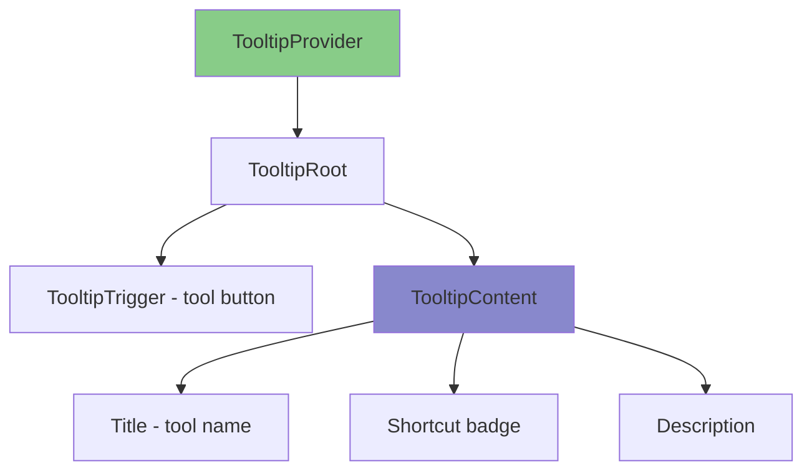

# Keyboard Shortcuts & Tooltip System Implementation Plan

## Overview

This plan addresses two interconnected features:

1. **Keyboard shortcuts for toolbar and sidebar tools** - Assign shortcuts to all tools, detect conflicts
2. **Comprehensive tooltip system** - Show tool name, shortcut, and description on hover

## Current State Analysis

### Existing Keyboard Shortcuts (from use-keyboard-shortcuts.ts)

| Shortcut                    | Action                     |
| --------------------------- | -------------------------- |
| Ctrl+Alt+N                  | Create new layer           |
| Ctrl+Z                      | Undo                       |
| Ctrl+Shift+Z / Ctrl+Y       | Redo                       |
| Ctrl+L                      | Toggle layer lock          |
| Ctrl+Shift+L                | Toggle layer visibility    |
| Ctrl+[ / Ctrl+]             | Layer reorder (down/up)    |
| Ctrl+Shift+[ / Ctrl+Shift+] | Layer to bottom/top        |
| Delete/Backspace            | Delete selected items      |
| Ctrl+D                      | Duplicate selected items   |
| Ctrl+A                      | Select all items in layer  |
| Escape                      | Clear selection            |
| Ctrl+Shift+L                | Reset layer panel position |
| Ctrl+G                      | Group selected items       |
| Ctrl+Shift+G                | Ungroup selected items     |

### Tools in left-tools-panel.tsx (line 21-35)

```typescript
const tools: { id: ToolType; name: string; icon: LucideIcon }[] = [
  { id: "select", name: "Select", icon: MousePointer2 },
  { id: "rectangle", name: "Rectangle", icon: Square },
  { id: "ellipse", name: "Ellipse", icon: Circle },
  { id: "line", name: "Line", icon: LineChart },
  { id: "arrow", name: "Arrow", icon: ArrowUpRight },
  { id: "text", name: "Text", icon: Type },
  { id: "image", name: "Image", icon: ImageIcon },
  { id: "pin", name: "Pin", icon: MapPin },
  { id: "hand", name: "Pan", icon: Hand },
];
```

## Proposed Shortcut Assignment

Single-key shortcuts (no modifier) are ideal for tool selection:

| Key | Tool      | Description                  |
| --- | --------- | ---------------------------- |
| V   | Select    | Select and manipulate shapes |
| R   | Rectangle | Draw rectangle shapes        |
| O   | Ellipse   | Draw ellipse/circle shapes   |
| L   | Line      | Draw line shapes             |
| A   | Arrow     | Draw arrow connectors        |
| T   | Text      | Add text elements            |
| I   | Image     | Insert images                |
| P   | Pin       | Add location pins            |
| H   | Hand/Pan  | Pan the canvas               |

Modifier key shortcuts reserved for system operations (Undo, Redo, etc.)

## Implementation Components

### 1. Tooltip Provider Component

Create `src/components/ui/tooltip-provider.tsx` using @radix-ui/react-tooltip:

```typescript
// Radix UI Tooltip primitives
import * as Tooltip from "@radix-ui/react-tooltip";

// Features:
// - Provider wrapper for app-level setup
// - Configurable delay (default 400ms)
// - Accessible (aria-describedby, role="tooltip")
// - Position auto-adjustment to avoid viewport overflow
// - Fade animations via CSS
```

### 2. Tooltip Structure

Each tooltip will display:

- **Title**: Tool name (e.g., "Rectangle")
- **Shortcut**: Formatted key (e.g., "R")
- **Description**: Brief explanation

### 3. Tool Tip Component

Create `src/components/ui/tool-tip.tsx`:

```typescript
interface ToolTipProps {
  children: React.ReactNode;
  title: string;
  shortcut?: string;
  description?: string;
  side?: "top" | "right" | "bottom" | "left";
  delayDuration?: number;
}
```

### 4. Tool Shortcut Map

Create `src/config/keyboard-shortcuts.ts`:

```typescript
export const TOOL_SHORTCUTS: Record<
  ToolType,
  {
    key: string;
    title: string;
    description: string;
  }
> = {
  select: {
    key: "V",
    title: "Select",
    description: "Select and manipulate shapes",
  },
  rectangle: {
    key: "R",
    title: "Rectangle",
    description: "Draw rectangle shapes",
  },
  // ... etc
};

// Conflict detection function
export function detectConflicts(): string[] {
  // Check for duplicate key bindings
}
```

### 5. Updated LeftToolsPanel

Update `left-tools-panel.tsx` to:

- Wrap tool buttons with ToolTip component
- Display shortcut badge on each tool
- Use the tool shortcut map

### 6. Updated Navbar

Update `navbar.tsx` to:

- Add ToolTip to navigation icons (workspace, profile, notifications)
- Display shortcuts where applicable

### 7. Keyboard Shortcut Handler Extension

Extend `use-keyboard-shortcuts.ts` to handle:

- Tool selection shortcuts (V, R, O, L, A, T, I, P, H)
- Conflict detection
- Shortcut display update

## Mermaid: Tooltip Component Architecture



## File Structure

```
src/
├── components/
│   └── ui/
│       ├── tooltip-provider.tsx    (NEW - Radix wrapper)
│       ├── tooltip.tsx             (NEW - Tooltip primitives)
│       └── shortcut-badge.tsx       (NEW - styled key display)
├── config/
│   └── keyboard-shortcuts.ts       (NEW - shortcuts config + conflict detection)
├── hooks/
│   └── use-keyboard-shortcuts.ts    (MOD - add tool shortcuts)
├── layout/
│   ├── left-tools-panel.tsx        (MOD - add tooltips)
│   └── navbar.tsx                  (MOD - add tooltips)
```

## Key Dependencies

- @radix-ui/react-tooltip (needs installation if not present)

## Styling

Tooltip styling using CSS:

```css
.tooltip-content {
  animation: fadeIn 150ms ease-out;
  background: var(--navy-800);
  border: 1px solid var(--white/10);
  border-radius: 6px;
  padding: 8px 12px;
  max-width: 240px;
}

.shortcut-badge {
  display: inline-flex;
  align-items: center;
  justify-content: center;
  min-width: 20px;
  height: 20px;
  padding: 0 6px;
  background: var(--navy-700);
  border: 1px solid var(--white/20);
  border-radius: 4px;
  font-size: 11px;
  font-weight: 500;
  font-family: monospace;
}
```

## Implementation Sequence

1. **Install @radix-ui/react-tooltip** (if needed)
2. **Create tooltip-provider.tsx** - Radix setup
3. **Create tooltip.tsx** - TooltipTrigger and TooltipContent primitives
4. **Create keyboard-shortcuts.ts** - Config and conflict detection
5. **Update left-tools-panel.tsx** - Wrap tools with ToolTip
6. **Update navbar.tsx** - Add ToolTip to nav icons
7. **Extend use-keyboard-shortcuts.ts** - Add tool selection shortcuts
8. **Update keyboard-shortcuts-modal.tsx** - Display all shortcuts

## Accessibility Requirements

- `role="tooltip"` on content
- `aria-describedby` on trigger
- Focus trap within tooltip (if contains interactive elements)
- Escape key closes tooltip
- Arrow key navigation between tooltips
- Respect reduced-motion preference
