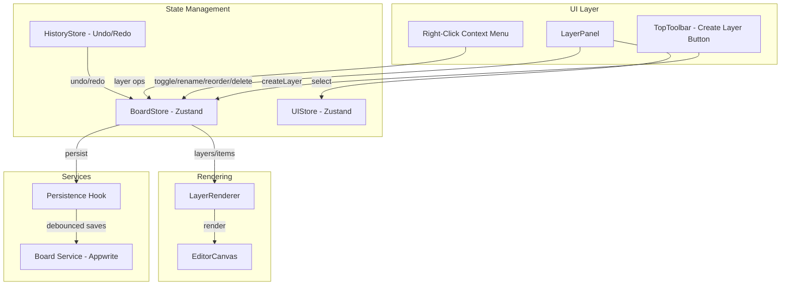
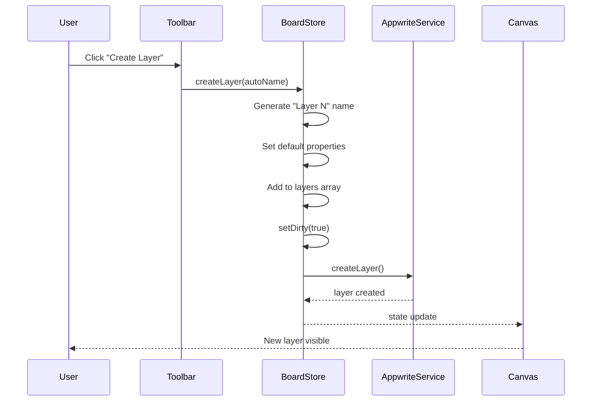
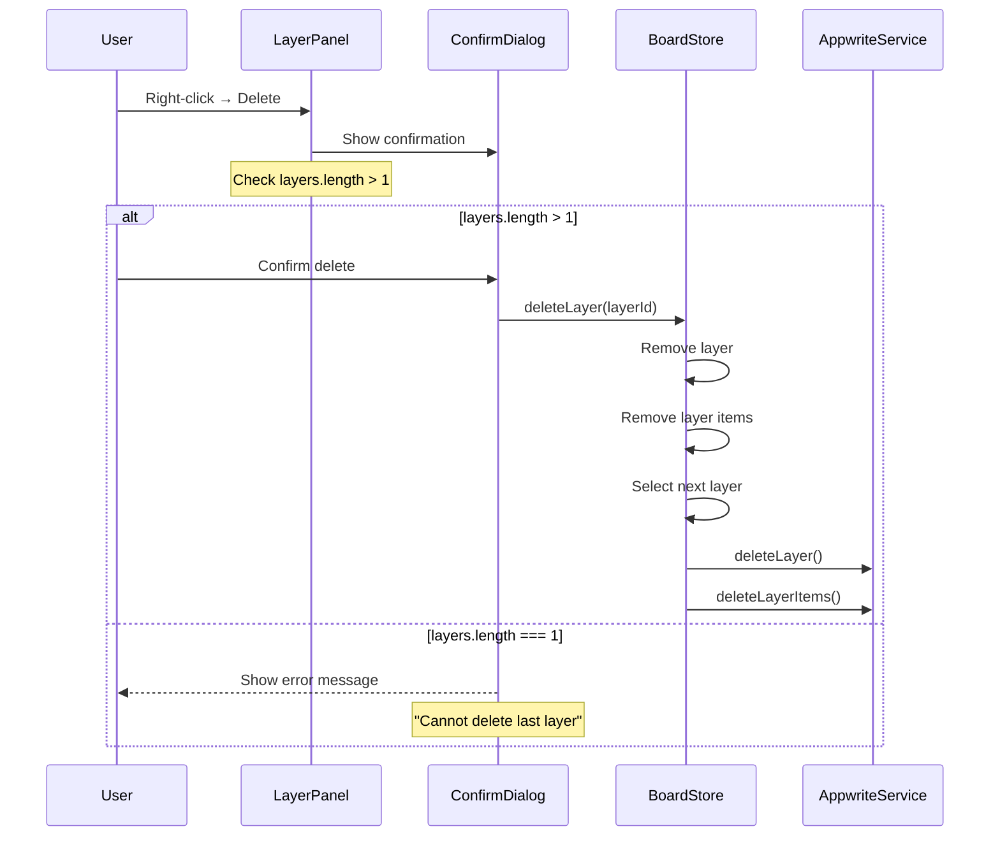

# Layer Management System - Implementation Plan

## Overview

This document outlines the implementation plan for a comprehensive layer management system integrated into the Planymaps workspace interface. The system will enable users to create, organize, and manipulate layers to manage visual elements on the canvas.

## Architecture Overview



## Implementation Tasks

### 1. Undo/Redo History Store

**File:** `src/stores/history-store.ts` (new)

- Create a Zustand store for managing history
- Implement command pattern for layer operations
- Store up to 50 actions in memory
- Actions to track:
  - `createLayer`
  - `deleteLayer`
  - `renameLayer`
  - `toggleLayerVisibility`
  - `toggleLayerLock`
  - `changeLayerOpacity`
  - `reorderLayers`
  - `moveItemToLayer`

**Interface:**

```typescript
interface HistoryState {
  past: HistoryEntry[];
  future: HistoryEntry[];
  canUndo: boolean;
  canRedo: boolean;
}

interface HistoryEntry {
  type: string;
  timestamp: number;
  previousState: Partial<BoardState>;
  newState: Partial<BoardState>;
  description: string;
}
```

### 2. Enhance Board Store

**File:** `src/stores/board-store.ts`

Add new layer management actions:

- `createLayer()` - Auto-generate name with incrementing number (Layer 1, Layer 2, etc.)
- `deleteLayer(layerId)` - With minimum 1 layer protection
- `duplicateLayer(layerId)` - Clone layer with all items

### 3. Create Layer Button in Toolbar

**File:** `src/components/layout/top-toolbar.tsx`

- Add "Create Layer" button next to existing share button
- Position: Between share button and layer panel toggle
- Style: Accent gradient matching existing share button
- Action: Immediately creates a new layer with auto-generated name

### 4. Enhance Layer Panel

**File:** `src/components/layout/layer-panel.tsx`

**4.1 Background Styling (85% opacity)**

```css
/* New class for layer panel */
.layer-panel-bg {
  background: rgba(15, 23, 42, 0.85);
  backdrop-filter: blur(12px);
  -webkit-backdrop-filter: blur(12px);
}
```

**4.2 Layer Item Component Enhancements**

| Feature           | Implementation                      |
| ----------------- | ----------------------------------- |
| Visibility Toggle | Eye icon - toggles `layer.visible`  |
| Lock Toggle       | Lock icon - toggles `layer.locked`  |
| Opacity Control   | Slider (0-100%) + percentage input  |
| Reorder Controls  | Up/Down arrows for manual reorder   |
| Drag Handle       | Visual indicator for drag-and-drop  |
| Active Indicator  | Highlight border for selected layer |
| Layer Name        | Editable on double-click            |

**4.3 Context Menu (Right-Click)**

- Bring to Front
- Send to Back
- Bring Forward
- Send Backward
- Duplicate Layer
- Delete Layer (with confirmation)
- Rename Layer

### 5. Layer Operations

**5.1 Create Layer**

- Default name: "Layer N" (where N is auto-incrementing)
- Default visibility: `true`
- Default locked: `false`
- Default opacity: `1` (100%)
- Default orderIndex: last position

**5.2 Delete Layer**

- Guard: Minimum 1 layer must exist
- Confirmation dialog required
- Items on deleted layer are also deleted
- Select next available layer after deletion

**5.3 Reorder Layers**

- Up/Down buttons in layer panel
- Drag-and-drop support
- Uses existing `ordering-commands.ts` functions
- Updates `orderIndex` for all affected layers

**5.4 Change Layer Opacity**

- Slider: 0-100%
- Direct input field
- Updates `layer.opacity` property
- Real-time canvas update via Konva layer opacity

### 6. Keyboard Shortcuts

| Shortcut       | Action                                    |
| -------------- | ----------------------------------------- |
| `Ctrl+Shift+N` | Create new layer                          |
| `Ctrl+L`       | Toggle selected layer lock                |
| `Ctrl+Shift+L` | Toggle selected layer visibility          |
| `Ctrl+[`       | Send layer backward                       |
| `Ctrl+]`       | Bring layer forward                       |
| `Ctrl+Shift+[` | Send layer to back                        |
| `Ctrl+Shift+]` | Bring layer to front                      |
| `Delete`       | Delete selected layer (with confirmation) |

### 7. State Synchronization

**Canvas Rendering:**

- `LayerRenderer` already respects `layer.visible` and `layer.opacity`
- When `layer.locked` is true, `listening={false}` prevents interaction
- Real-time updates via Zustand selector subscriptions

**Panel ↔ Canvas Sync:**

- Both `LayerPanel` and `EditorCanvas` subscribe to `useBoardStore`
- Changes propagate immediately to both
- No explicit sync needed - Zustand handles reactivity

### 8. Persistence Integration

**File:** `src/hooks/use-persistence.ts`

Layer operations that trigger persistence:

- `createLayer` → calls `boardService.createLayer()`
- `updateLayer` → calls `boardService.updateLayer()` (debounced)
- `deleteLayer` → calls `boardService.deleteLayer()`
- `reorderLayers` → calls `boardService.reorderLayers()`

### 9. Component Files to Modify

| File                                       | Changes                              |
| ------------------------------------------ | ------------------------------------ |
| `src/stores/board-store.ts`                | Add layer CRUD actions               |
| `src/stores/ui-store.ts`                   | Add layer context menu state         |
| `src/components/layout/top-toolbar.tsx`    | Add Create Layer button              |
| `src/components/layout/layer-panel.tsx`    | Full redesign with all features      |
| `src/components/editor/layer-renderer.tsx` | Add opacity/lock handling            |
| `src/components/editor/context-menu.tsx`   | Add layer operations                 |
| `src/hooks/use-persistence.ts`             | Add layer persistence                |
| `src/app/globals.css`                      | Add layer-panel-bg class             |
| `src/lib/ordering-commands.ts`             | Already has layer ordering functions |

### 10. New Files to Create

| File                                  | Purpose                    |
| ------------------------------------- | -------------------------- |
| `src/stores/history-store.ts`         | Undo/redo implementation   |
| `src/hooks/use-keyboard-shortcuts.ts` | Keyboard shortcut handling |

## Mermaid: Layer Creation Flow



## Mermaid: Layer Deletion Flow



## Implementation Priority

1. **Phase 1 - Core Layer Operations**
   - Create layer button in toolbar
   - Basic layer panel with visibility/lock toggles
   - Layer creation/deletion with minimum-1 protection

2. **Phase 2 - Enhanced UI**
   - Opacity slider
   - Reorder controls (up/down buttons)
   - Layer naming (editable)
   - 85% opacity background styling

3. **Phase 3 - Advanced Features**
   - Drag-and-drop reordering
   - Context menu
   - Keyboard shortcuts
   - Undo/redo support

## Testing Checklist

- [ ] Create layer button creates new layer immediately
- [ ] Auto-generated names increment correctly (Layer 1, Layer 2, etc.)
- [ ] Visibility toggle hides/shows layer on canvas
- [ ] Lock toggle prevents selection/editing on canvas
- [ ] Opacity slider updates canvas in real-time
- [ ] Cannot delete last remaining layer
- [ ] Confirmation dialog appears for delete
- [ ] Up/down reorder buttons work correctly
- [ ] Keyboard shortcuts trigger correct actions
- [ ] Undo reverses layer operations
- [ ] Redo restores layer operations
- [ ] Layer panel maintains 85% opacity
- [ ] Active layer shows visual selection indicator
