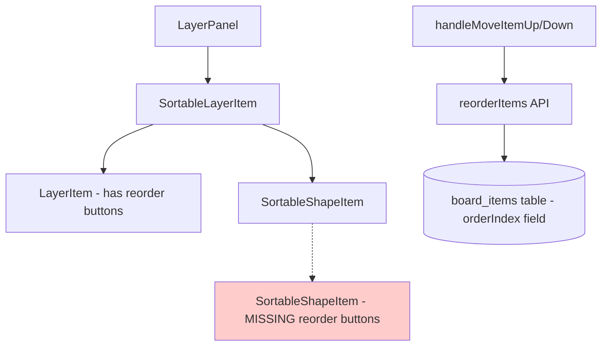

# Layer Panel - Reorder & Rename Implementation Plan

## Current State Analysis

### Component Structure

```
LayerPanel (main component)
├── SortableLayerItem (wraps LayerItem with dnd-kit)
│   └── LayerItem (layer row with reorder buttons, rename)
│       └── SortableShapeItem[] (shape rows - NO reorder buttons, NO rename)
├── RenameModal (for layer rename)
└── DeleteModal (for layer delete)
```

### Issue #1: Shape Reorder Buttons Not Working

**Root Cause:** `SortableShapeItem` component (line 497-584) does NOT have `onMoveUp` or `onMoveDown` props implemented. The component only has:

- `onSelectItem`
- `onToggleItemVisibility`
- `onToggleItemLock`

The layer reorder works because `LayerItemProps` (line 242-243) has `onMoveUp` and `onMoveDown`, and these are wired to `handleMoveLayerUp` / `handleMoveLayerDown` callbacks (line 1070-1118).

**Solution:** Add reorder functionality to shapes similar to layers.

### Issue #2: Shape Double-Click Rename Not Implemented

**Root Cause:** `SortableShapeItem` does NOT have:

- `onRenameInline` prop
- `isEditingName` state
- Double-click handler (`onDoubleClick`)
- Inline edit UI

The layer rename works because `LayerItem` (line 283-300) has:

- `const [isEditingName, setIsEditingName] = useState(false)`
- `const [editedName, setEditedName] = useState(layer.name)`
- `useEffect` for focusing and selecting input
- `handleNameSubmit` function
- Inline edit UI with input field

**Solution:** Implement equivalent functionality for `SortableShapeItem`.

---

## Implementation: Shape Reorder

### Step 1: Update `SortableShapeItemProps` interface

Add `onMoveUp`, `onMoveDown` props at line 488-495:

```typescript
interface SortableShapeItemProps {
  item: BoardItem;
  layerId: string;
  isItemSelected: boolean;
  onSelectItem: (itemId: string, addToSelection: boolean) => void;
  onToggleItemVisibility: (itemId: string) => void;
  onToggleItemLock: (itemId: string) => void;
  onMoveUp: (itemId: string) => void; // ADD
  onMoveDown: (itemId: string) => void; // ADD
  canMoveUp: boolean; // ADD
  canMoveDown: boolean; // ADD
}
```

### Step 2: Update `SortableShapeItem` function signature

Update at line 497-504 to accept new props and add state for disabled buttons.

### Step 3: Add reorder buttons UI

After the lock toggle button (after line 575), add reorder buttons similar to `LayerItem`:

```tsx
{
  /* Reorder buttons */
}
<div className="flex items-center gap-0.5 opacity-0 group-hover:opacity-100 transition-opacity ml-auto">
  <button
    onClick={(e) => {
      e.stopPropagation();
      onMoveUp(item.$id);
    }}
    disabled={!canMoveUp}
    className="w-5 h-5 flex items-center justify-center rounded hover:bg-white/10 text-[var(--gray-500)] hover:text-white disabled:opacity-30 disabled:cursor-not-allowed transition-colors"
    title="Move up"
  >
    <ChevronUpIcon />
  </button>
  <button
    onClick={(e) => {
      e.stopPropagation();
      onMoveDown(item.$id);
    }}
    disabled={!canMoveDown}
    className="w-5 h-5 flex items-center justify-center rounded hover:bg-white/10 text-[var(--gray-500)] hover:text-white disabled:opacity-30 disabled:cursor-not-allowed transition-colors"
    title="Move down"
  >
    <ChevronDownIcon />
  </button>
</div>;
```

### Step 4: Add item reorder handlers

Add callbacks similar to `handleMoveLayerUp/handleMoveLayerDown`. Add around line 1120:

```typescript
// Move item up
const handleMoveItemUp = useCallback(
  (itemId: string, layerId: string) => {
    const items = itemsByLayer[layerId] || [];
    const sorted = [...items].sort((a, b) => a.orderIndex - b.orderIndex);
    const index = sorted.findIndex((i) => i.$id === itemId);

    if (index < sorted.length - 1) {
      const previousItems = [...items];
      const newItems = [...sorted];
      const temp = newItems[index];
      newItems[index] = newItems[index + 1];
      newItems[index + 1] = temp;

      // Update orderIndex for all items
      const updates = newItems.map((item, idx) => ({
        id: item.$id,
        orderIndex: idx,
      }));

      pushEntry({
        type: "REORDER_ITEMS",
        description: "Move item up",
        previousItems,
        newItems,
      });

      reorderItems(updates);
    }
  },
  [itemsByLayer, pushEntry, reorderItems],
);

// Move item down
const handleMoveItemDown = useCallback(
  (itemId: string, layerId: string) => {
    const items = itemsByLayer[layerId] || [];
    const sorted = [...items].sort((a, b) => a.orderIndex - b.orderIndex);
    const index = sorted.findIndex((i) => i.$id === itemId);

    if (index > 0) {
      const previousItems = [...items];
      const newItems = [...sorted];
      const temp = newItems[index];
      newItems[index] = newItems[index - 1];
      newItems[index - 1] = temp;

      const updates = newItems.map((item, idx) => ({
        id: item.$id,
        orderIndex: idx,
      }));

      pushEntry({
        type: "REORDER_ITEMS",
        description: "Move item down",
        previousItems,
        newItems,
      });

      reorderItems(updates);
    }
  },
  [itemsByLayer, pushEntry, reorderItems],
);
```

### Step 5: Wire up props in `SortableLayerItem`

In the `SortableShapeItem` render at line 680-688, add new props:

```tsx
<SortableShapeItem
  key={item.$id}
  item={item}
  layerId={layer.$id}
  isItemSelected={selectedItemIds.includes(item.$id)}
  onSelectItem={onSelectItem}
  onToggleItemVisibility={onToggleItemVisibility}
  onToggleItemLock={onToggleItemLock}
  onMoveUp={(itemId) => handleMoveItemUp(itemId, layer.$id)} // ADD
  onMoveDown={(itemId) => handleMoveItemDown(itemId, layer.$id)} // ADD
  canMoveUp={/* calculate based on position */} // ADD
  canMoveDown={/* calculate based on position */} // ADD
/>
```

---

## Implementation: Shape Double-Click Rename

### Step 1: Add `onRenameInline` to `SortableShapeItemProps`

```typescript
interface SortableShapeItemProps {
  // ... existing props
  onRenameInline: (itemId: string, newName: string) => void; // ADD
}
```

### Step 2: Add editing state to `SortableShapeItem`

```typescript
function SortableShapeItem({
  item,
  // ... existing props
  onRenameInline,  // ADD
}: SortableShapeItemProps) {
  const [isEditingName, setIsEditingName] = useState(false);   // ADD
  const [editedName, setEditedName] = useState(item.name || ""); // ADD
  const nameInputRef = useRef<HTMLInputElement>(null);           // ADD

  // Keep editedName in sync when not editing
  useEffect(() => {
    if (!isEditingName) {
      setEditedName(item.name || "");
    }
  }, [item.name, isEditingName]);

  // Focus and select input when editing
  useEffect(() => {
    if (isEditingName && nameInputRef.current) {
      nameInputRef.current.focus();
      nameInputRef.current.select();
    }
  }, [isEditingName]);

  const handleNameSubmit = () => {                               // ADD
    const trimmed = editedName.trim();
    if (trimmed && trimmed !== item.name) {
      onRenameInline(item.$id, trimmed);
    }
    setIsEditingName(false);
  };
```

### Step 3: Add double-click handler and inline edit UI

Add `onDoubleClick` to the main div at line 524:

```tsx
<div
  ref={setNodeRef}
  style={style}
  onDoubleClick={() => setIsEditingName(true)}  // ADD
  className={`
    group flex items-center gap-1 px-2 py-1 rounded-lg
    transition-colors duration-150 cursor-pointer
    ${isItemSelected ? "bg-[var(--accent-500)]/10 text-[var(--accent-400)]" : "hover:bg-white/5 text-[var(--gray-400)]"}
    ${!item.visible ? "opacity-40" : ""}
    ${isDragging ? "opacity-40 scale-[0.97] z-10" : ""}
  `}
  onClick={() => !item.locked && onSelectItem(item.$id, false)}
>
```

Replace the name display (around line 578-582) with conditional rendering:

```tsx
{
  isEditingName ? (
    <input
      ref={nameInputRef}
      type="text"
      value={editedName}
      onChange={(e) => setEditedName(e.target.value)}
      onKeyDown={(e) => {
        if (e.key === "Enter") handleNameSubmit();
        if (e.key === "Escape") setIsEditingName(false);
      }}
      onBlur={handleNameSubmit}
      onClick={(e) => e.stopPropagation()}
      className="flex-1 px-1 py-0.5 text-sm bg-[var(--navy-800)] border border-[var(--accent-500)] rounded text-white focus:outline-none"
    />
  ) : (
    <span className="flex-1 truncate text-sm">{item.name || "Untitled"}</span>
  );
}
```

### Step 4: Add rename handler in LayerPanel

Add callback around line 1118:

```typescript
// Rename item
const handleRenameItem = useCallback(
  (itemId: string, newName: string) => {
    updateItem(itemId, { name: newName });
    showSuccess("Item renamed");
  },
  [updateItem],
);
```

### Step 5: Wire up in SortableLayerItem

```tsx
<SortableShapeItem
  // ... existing props
  onRenameInline={handleRenameItem} // ADD
/>
```

---

## Summary of Changes

| Location                           | Change                                                                       |
| ---------------------------------- | ---------------------------------------------------------------------------- |
| `SortableShapeItemProps` interface | Add `onMoveUp`, `onMoveDown`, `canMoveUp`, `canMoveDown`, `onRenameInline`   |
| `SortableShapeItem` function       | Add state (`isEditingName`, `editedName`, `nameInputRef`), effects, handlers |
| UI buttons                         | Add reorder buttons after lock toggle; add inline edit input                 |
| LayerPanel callbacks               | Add `handleMoveItemUp`, `handleMoveItemDown`, `handleRenameItem`             |
| Prop wiring                        | Pass new props through `SortableLayerItem` to `SortableShapeItem`            |

---

## Mermaid: Component Flow for Reorder



## Mermaid: Component Flow for Rename

```mermaid
graph TD
    A[LayerPanel] --> B[SortableLayerItem]
    B --> C[SortableShapeItem]
 h    C --> D{double-click}
    D -->|yes| E[Inline edit mode]
    E --> F[handleNameSubmit]
    F --> G[handleRenameItem]
    G --> H[updateItem API]
    H --> I[(board_items table - name field)]

    style C fill:#ccffcc
```
